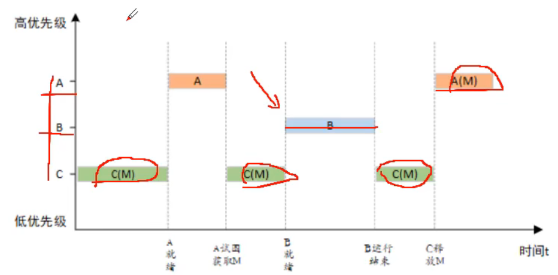

# 一、初始Rt-Thread

# 二、动态内存堆的使用

rt-thread提供动态内存分配机制，通过rt-thread提供的api，用户可以自由的分分配内存，方便程序的编写

## 简述堆栈

堆和栈的概念

栈（stack）：有编译器自动分配释放

堆（heap）：有程序员进行分配和释放

```c
int a = 0;//全局初始化区
char *p1;//全局未初始化区
main()
{
	int b;//栈
	char s[] = "abc";//栈
	char *p2;//栈
	char *p3="123456";//"123456\\0"在常量区，p3在栈上
	static int c=0;//全局（静态）初始化区
	p1=(cahr*)malloc(10);//堆
	p2=(char*)malloc(20);//堆
}
```

## RT-Thread动态内存配置和使用

rt_system_heap_init((void *)HEAP_BEGIN, (void *)HEAP_END);

在void rt_hw_board_init(void)中调用

```c
void rt_system_heap_init(void *begin_addr, void *end_addr)
{
    struct heap_mem *mem;
    rt_uint32_t begin_align = RT_ALIGN((rt_uint32_t)begin_addr, RT_ALIGN_SIZE);
    rt_uint32_t end_align = RT_ALIGN_DOWN((rt_uint32_t)end_addr, RT_ALIGN_SIZE);

    RT_DEBUG_NOT_IN_INTERRUPT;

    /* alignment addr */
    if ((end_align > (2 * SIZEOF_STRUCT_MEM)) &&
        ((end_align - 2 * SIZEOF_STRUCT_MEM) >= begin_align))
    {
        /* calculate the aligned memory size */
        mem_size_aligned = end_align - begin_align - 2 * SIZEOF_STRUCT_MEM;
    }
    else
    {
        rt_kprintf("mem init, error begin address 0x%x, and end address 0x%x\\n",
                   (rt_uint32_t)begin_addr, (rt_uint32_t)end_addr);

        return;
    }

    /* point to begin address of heap */
    heap_ptr = (rt_uint8_t *)begin_align;

    RT_DEBUG_LOG(RT_DEBUG_MEM, ("mem init, heap begin address 0x%x, size %d\\n",
                                (rt_uint32_t)heap_ptr, mem_size_aligned));

    /* initialize the start of the heap */
    mem        = (struct heap_mem *)heap_ptr;
    mem->magic = HEAP_MAGIC;
    mem->next  = mem_size_aligned + SIZEOF_STRUCT_MEM;
    mem->prev  = 0;
    mem->used  = 0;
#ifdef RT_USING_MEMTRACE
    rt_mem_setname(mem, "INIT");
#endif

    /* initialize the end of the heap */
    heap_end        = (struct heap_mem *)&heap_ptr[mem->next];
    heap_end->magic = HEAP_MAGIC;
    heap_end->used  = 1;
    heap_end->next  = mem_size_aligned + SIZEOF_STRUCT_MEM;
    heap_end->prev  = mem_size_aligned + SIZEOF_STRUCT_MEM;
#ifdef RT_USING_MEMTRACE
    rt_mem_setname(heap_end, "INIT");
#endif

    rt_sem_init(&heap_sem, "heap", 1, RT_IPC_FLAG_FIFO);

    /* initialize the lowest-free pointer to the start of the heap */
    lfree = (struct heap_mem *)heap_ptr;
}
```

输入参数为可用于作为堆区的起始地址和结束地址

\#define    HEAP_BEGIN              ((void *)&Image$$RW_IRAM1$$ZI$$Limit)

\#define    HEAP_END                 STM32_SRAM_END

\#define    STM32_SRAM_END    (0x20000000 + STM32_SRAM_SIZE * 1024)

Image$$RW_IRAM1$$ZI$$Limit 是一个链接器导出的符号，代表ZI段结束，也就是程序执行区的RAM结束后的地址，反过来也就是我们执行区的RAM未使用的区域的起始地址

使用dynmem_sample.c样例

## 动态内存堆使用注意点

### 内存复位

当我们每次申请到新的内存块之后，申请到的内存块不一定是零，有可能是上一次申请后遗留下来的值，所以建议对所申请到的内存进行清零操作。

```c
char* p = rt_malloc(10);
if(p == RT_NULL)
{
	rt_memset(p,0,10);//清零操作
}
```

### 内存泄漏

内存泄漏（Memory Leak）是指程序中已动态分配的堆存储由于某种原因 程序未释放或无法释放，造成系统内存的浪费，导致程序运行速度减慢甚至系统奔溃等严重的后果。

我们在使用动态内存时需要注意：rt_malloc需要和rt_free配套使用

## 其他动态内存相关的API

void *rt_realloc(void *rmem, rt_size_t newsize)

在已分配内存块的基础上重新分配内存块的大小（增加或缩小）

在进行重新分配内存块时，原来的内存块数据保持不变（缩小的情况下，后面的数据被自动截断）

void *rt_calloc(rt_size_t count, rt_size_t size)

从内存堆中分配连续内存地址的多少内存块

# 三、线程的创建

人们在生活中处理复杂的问题时，惯用的方法就是“分而治之”，即把一个大问题分解成多个相对简单的、比较容易解决的小问题，小问题逐个被解决了，大问题也就随之解决了。同样，在设计一个较为复杂的应用程序时，也通常把一个大型任务分解成多个小任务，然后通过运行这些小任务，最终达到完成大任务的目的。

在RT-Thread中，与上述小任务对应的程序实体就叫做“线程”(或任务)，RT-Thread就是一个能对这些小“线程”进行管理和调度的多“线程”操作系统

线程时实现任务的载体，它是RT-Thread中最基本的调度单位，它描述了一个任务执行的运行环境，也描述了这个任务所处的优先等级。

## 线程组成

RT-Thread中，线程有三部分组成：线程代码（入口函数）、线程控制块、线程堆栈

### 线程代码

```c
//无线循环结构
void thread_entry(void *parameter)
{
	while(1)
	{
		/*等待事件的发生*/

		/*处理事件*/	
	}
}

//顺序执行结构
void thread_entry(void *parameter)
{
	/*事务1处理*/
	/*事务2处理*/

	/*事务3处理*/
}
```

### 线程控制块

线程控制块是操作系统用于管理线程的一个数据结构，他会存放线程的一个信息，例如优先级、线程名称、线程状态等，也包括线程与线程之间连接用的链表结构，线程等待事件结合等。

```
struct rt_thread
struct rt_thread *rt_thread_t
struct rt_thread
{
    /* rt object */
    char        name[RT_NAME_MAX];                      /**< the name of thread */
    rt_uint8_t  type;                                   /**< type of object */
    rt_uint8_t  flags;                                  /**< thread's flags */

#ifdef RT_USING_MODULE
    void       *module_id;                              /**< id of application module */
#endif

    rt_list_t   list;                                   /**< the object list */
    rt_list_t   tlist;                                  /**< the thread list */

    /* stack point and entry */
    void       *sp;                                     /**< stack point */
    void       *entry;                                  /**< entry */
    void       *parameter;                              /**< parameter */
    void       *stack_addr;                             /**< stack address */
    rt_uint32_t stack_size;                             /**< stack size */

    /* error code */
    rt_err_t    error;                                  /**< error code */

    rt_uint8_t  stat;                                   /**< thread status */

    /* priority */
    rt_uint8_t  current_priority;                       /**< current priority */
    rt_uint8_t  init_priority;                          /**< initialized priority */
#if RT_THREAD_PRIORITY_MAX > 32
    rt_uint8_t  number;
    rt_uint8_t  high_mask;
#endif
    rt_uint32_t number_mask;

#if defined(RT_USING_EVENT)
    /* thread event */
    rt_uint32_t event_set;
    rt_uint8_t  event_info;
#endif

#if defined(RT_USING_SIGNALS)
    rt_sigset_t     sig_pending;                        /**< the pending signals */
    rt_sigset_t     sig_mask;                           /**< the mask bits of signal */

    void            *sig_ret;                           /**< the return stack pointer from signal */
    rt_sighandler_t *sig_vectors;                       /**< vectors of signal handler */
    void            *si_list;                           /**< the signal infor list */
#endif

    rt_ubase_t  init_tick;                              /**< thread's initialized tick */
    rt_ubase_t  remaining_tick;                         /**< remaining tick */

    struct rt_timer thread_timer;                       /**< built-in thread timer */

    void (*cleanup)(struct rt_thread *tid);             /**< cleanup function when thread exit */

    /* light weight process if present */
#ifdef RT_USING_LWP
    void        *lwp;
#endif

    rt_uint32_t user_data;                             /**< private user data beyond this thread */
};
typedef struct rt_thread *rt_thread_t;
```

### 线程栈

RT-Thread每个线程都具有独立的栈空间，当进行线程切换时，系统会将当前线程的上下文保存在线程栈中，当线程要恢复运行时，在从线程栈中读取上下文信息，恢复线程的运行

线程上下文是指线程执行时的环境，具体来说就是各个变量和数据包括所有寄存器变量、堆栈信息。内存信息等。

线程栈在形式上是一段连续的内存空间，我们可以通过定义一个数组或者申请一段动态内存来作为线程栈。

## 线程创建

### 创建线程方法

```c
//创建静态线程
//因为，该线程需要实现定义号线程控制块和线程栈空间
rt_err_t rt_thread_init(struct rt_thread *thread,//线程控制块
                        const char       *name,//线程名字
                        void (*entry)(void *parameter),//线程代码
                        void             *parameter,//线程代码的参数
                        void             *stack_start,//线程栈起始地址
                        rt_uint32_t       stack_size,//线程栈大小
                        rt_uint8_t        priority,//线程优先级
                        rt_uint32_t       tick);//时间片参数

//创建动态线程
//因为该线程的线程控制块和线程栈空间是自动分配的
rt_thread_t rt_thread_create(const char *name,
                             void (*entry)(void *parameter),
                             void       *parameter,
                             rt_uint32_t stack_size,
                             rt_uint8_t  priority,
                             rt_uint32_t tick);
```

## 静态线程VS动态线程

### 相关资源分配形式

静态线程需要实现分配好线程控制块和线程栈

而动态线程自动的分配线程控制块和线程栈

### 运行效率

如果动态线程的线程控制块、线程栈与静态线程的线程控制块、线程栈都定义在芯片的内部RAM中，则这两个线程运行的效率一样哦

反之，如果线程控制块和线程栈定义在外扩的RAM中的话，该线程执行的效率会变低。

# 四、简单的线程实例-跑马灯

## 线程状态切换


## 系统滴答时钟

每一个操作系统中都存在一个“系统心跳”时钟，是操作系统中最小的时钟单位。这个时钟负责系统和时间相关的一些操作。作为操作系统运行的时间尺度，心跳时钟是由硬件定时器的定时中断产生。

系统的心跳时钟我们也常称之为系统滴答或者时钟节拍，系统滴答的频率需要我们根据cpu的处理能力来决定。

时钟节拍使得内核可以将线程延时若干个整数时钟节拍，以及现场等待时间发生时，提供等待超时的依据。

频率越快，内核函数介入系统运行的机率就越大，内核占用处理器的时间久越长，系统的负荷就变大；

时间越小处理精度就不够；

我们在stm32平台上一般设置系统滴答频率为100HZ，即每个滴答的时间是100ms

## GPIO驱动架构操作IO

### IO初始化

`void rt_pin_mode(rt_base_t pin, rt_base_t mode)`

mode:

PIN_MODE_OUTPUT（推完输出） 

PIN_MODE_OUTPUT_OD（开漏输出）

PIN_MODE_INPUT （）

PIN_MODE_INPUT_PULLUP （上拉电阻输入）

PIN_MODE_INPUT_PULLDOWN （下拉电阻输入）

### IO写入

`void rt_pin_write（rt_base_t pin, rt_base_t value）`

value:

PIN_HIGH PIN_LOW

### IO读出

`int rt_pin_read（rt_base_t pin）`

## 线程栈大小分配

先将线程栈大小设置为一个固定值（比如2048），在线程运行时通过查看线程栈的使用情况（list_thread命令），了解线程栈使用的实际情况，根据情况设置合理的栈大小


一般将线程栈最大使用量设置为70%

## 实例-跑马灯代码

```c
//thread_sample.c中
static rt_thread_t tid2 = RT_NULL;

/* led线程的入口函数 */
static void led_entry(void *parameter)
{
    rt_pin_mode(14, PIN_MODE_OUTPUT);

    while (1)
    {
        rt_pin_write(14, PIN_LOW);
		rt_thread_delay(50);
		rt_pin_write(14, PIN_HIGH);
		rt_thread_delay(50);
    }
}

int led_sample(void)
{
	/*动态线程*/
    /* 创建led线程，名称是led_test，入口是led_entry*/
    tid2 = rt_thread_create("led_test",
                            led_entry, RT_NULL,
                            160,
                            5, 5);
    
    /* 如果获得线程控制块，启动这个线程 */
    if (tid2 != RT_NULL)
        rt_thread_startup(tid2);
	
	return 0;
}
```

# 五、线程的时间片轮询调度

## 线程优先级

优先级和时间片是线程的两个重要的参数。分别描述了线程竞争处理器资源的能力和持有处理器时间长短的能力 。

RT-Thread最大支持256个优先级（数值越小的优先级越高，0为最高优先级，最低优先级预留给空闲线程）；用户可以通过rt_config.h中的RT_THREAD_PRIORITY_MAX宏来修改最大支持的优先级；针对STM32默认设置最大支持32个优先级；

具体应用中，线程总数不受限制。能创建的线程总数之和具体硬件平台的存储有关。

## 线程时间片

时间片只有在==相同优先级==的就绪态线程中起作用，系统对优先级相同的就绪态线程采用时间片轮转的调度方式进行调度时，时间片起到约束线程单次运行时长的作用，其单位是一个系统节拍（OS Tick）；

假设有两个优先级相同的就绪态线程A和B，A线程的时间片设置为10，B线程的时间片设置为5，那么当系统中不存在比A优先级高的就绪态线程时，系统会在A、B线程间来回切换执行，并且每次对A线程执行10个节拍的时长，对B线程执行5个节拍的时长。


## 线程调度规则

### 优先级抢占调度

操作系统总是让具有最高优先级的就绪任务有限运行：即当有任务的优先级高于当前任务优先级并且处于就绪态后，就一定会发生任务调度。

通过优先级抢占机制，最大限度满足了系统的实时性。

### 时间轮片调度

当操作系统中存在相同优先级的线程时（优先级相同就不会抢占），操作系统就会按照设置的时间片老轮流调度线程，时间片起到约束线程单次运行时长的作用，其单位是一个系统节拍（OS Tick）

通过时间片轮询，保证优先级相同的任务就能够轮流占有处理器

# 六、空闲线程及两个常用的钩子函数

空闲线程是一个比较特殊的==系统线程==，它具备==最低==的优先级。当系统中无其他就绪线程可运行时，调度器将调度到空闲线程。

空闲线程还负责一些系统资源回收以及将一些处于关闭态的线程从线程调度列表中移除的动作。

空闲线程在形式上是一个无线循环结构，且永远不会被挂起。

在RT-Thread实时操作系统中空闲线程向用户提供了钩子函数，空闲线程钩子函数可以让系统在空闲的时候执行一些非紧急事务，列如系统运行指示灯闪烁，CPU使用率统计等等。

## 空闲线程钩子函数

#### 设置钩子函数

`rt_err_t rt_thread_idle_sethook(void (*hook)(void))`

#### 删除钩子函数

`rt_err_t rt_thread_idle_delhook(void (*hook)(void))`

### 空闲线程钩子函数实例

看 idlehook_sample.c 文件

### 空闲线程钩子函数使用注意

- 空闲线程是一个线程状态==永远为就绪态==的线程，所以钩子函数中执行的相关代码必须保证空闲线程在任何时刻都不会被挂起，例如rt_thread_delay()、rt_sem_take()等，可能会导致线程挂起的阻塞类函数都不能在钩子函数中使用。
- 空闲线程可以设置多个钩子函数，空闲线程最多可以设置4个钩子函数，这4个钩子函数轮流执行

## 系统调度钩子函数

系统的上下文切换是系统运行过程中最普遍的事件，有时用户可能会想知道在某一个时刻发生了什么样的线程切换，RT-Thread

向用户提供了一个西戎调度钩子函数，这个钩子函数在系统进行任务切换时运行，通过这个钩子函数，我们可以了解到系统任务调度时的一些信息。

#### 设置钩子函数

`rt_scheduler_sethook(void (*hook)(struct rt_thread *from,struct rt_thread *to))`

### 系统调用钩子函数实例

看 scheduler_sample.c 文件

# 七、临界区保护

## 临界资源

临界资源是指一次仅允许一个线程访问的共享资源。它可以是一个具体的硬件设备，也可以是一个变量、一个缓冲区。

不论是硬件临界资源，还是软件临界资源，多个线程必须互斥的对他们进行访问。

```
uint32_t value = 0;

void thread1_entry(void *para)
{
	uint32_t i = 0;
	for(i = 0; i < 10000; i++)
	{
		rt_kprintf("%d \r\n",value);
		value++;
	}
}

void thread2_entry(void * para)
{
	rt_thread+delay(50);
	value = 500;
}
```

value就是我们的临界资源，在第一个线程中，我们对value进行打印和自加操作，在第二个线程中对value进行赋值操作；在线程调度的作用下，线程2的切换会改变value的值，使得线程1中的for循环遭到破坏，所以需要在线程1进行for循环时对value进行临界值保护，不允许其他线程访问该value。

每个线程汇总访问（操作）临界资源的那段代码称之为临界区（Critical Section），我们每次只允许一个线程进入临界区；

## 临界区保护

RT_Thread提供了多种途径来进行临界区保护

### 关闭系统调度保护临界区

禁止调度、关闭中断

### 互斥特性保护临界区

信号量、互斥量

## 关闭系统调度

### 1.禁止调度

禁止调度，即是把调度器锁住，不让其进行线程切换。这样就能保证当前运行的任务不被换出，直到调度器解锁，所以禁止调度是常用的临界区保护方法。

```
void thread_entry(void *parameter)
{
	while(1)
	{
		/*调度器上锁，上锁后将不再切换到其他线程，仅响应中断*/
		rt_enter_critical();
		/*以下进入临界区*/
		....
		/*调度器解锁*/
		rt_exit_critical();
	
	}
}
```

### 2.关闭中断

因为所有线程的调度都是建立在中断的基础上的，所以，当我们关闭中断后，系统将不能再进行调度，线程自身也自然不会被其他线程抢占了

```
void thread_entry(void *parameter)
{
	rt_base_t lebel;
	while(1)
	{
		/*关闭中断*/
		level = rt_hw_interrupt_disable();
		/*以下进入临界区*/
		....
		/*使能中断*/
		rt_hw_interrupt_enable(level);
	}
}
```

缺点：在关闭中断后，系统的外部中断都不会得到有效的响应。但是禁止调度的方式只是将调度器锁住了，外部中断还是可以相应的。

## 临界区保护实例

自己看

# 八、信号量的使用

## IPC

在嵌入式系统中运行的代码主要包括线程和ISR，在它们的运行过程中，它们的运行步骤又是需要同步（按照预定的先后次序运行），他们访问的资源有时需要互斥（一个时刻只允许一个线程访问资源），他们之间有时也需要彼此交换数据。这些需求，有的是因为应用需求，有的是多线程编程模型带来的需求。

操作系统必须提供相应的机制来完成这些功能，我们把这些机制统称为进（线）程之间通信（Internal Process Communication IPC），RT_Thread中的IPC机制包括信号量、互斥量、事件、邮箱、消息队列

通过IPC机制，我们可以协调多个线程（包括ISR）“默契”的工作，从而共同完成整项工作。

## 列说信号量

以生活中的停车场为例来理解信号量的概念：

①当停车场空的时候，停车场的管理员发现有很多空车位，此时会让外面的车陆续进入停车场获得停车位；

②当停车场的车位满的时候，管理员发现已近没有空车位，将禁止外面的车进入停车场，车辆在外面排队等候；

③当停车场内有车离开时，管理员发现有空的车位让出，允许外面的车进入停车场；带空车位填满后，有禁止外部车辆进入

此例子中，管理员就相当于信号量；管理员手中空车位的个数就是信号量的值；停车位相当于公共资源，车辆相当于线程。车辆通过获得管理员的允许获得停车位，就类似于线程通过获得信号量访问公共资源。

## 信号量工作机制

信号量是一种轻型的用于解决线程间同步问题的内核对象，线程可以获得或释放它，从而达到同步或互斥的目的。


信号量 工作示意图如上所示：每个信号量对象都有一个信号量值和一个线程等待队列，信号量的值对应信号量对象的实例数目（资源数目），假如信号量值N，则表示共有N个信号量实例（资源）可以被使用，当信号量实例数目为零时，请求该信号量的线程就会被挂在该信号量的等待队列上，等待可用的信号量实例（资源）；

## 信号量控制块

在RT_Thread中，信号量控制块是操作系统用于管理信号量的一个数据结构。

```
struct rt_semaphore
{
	struct rt_ipc_object parent;	//inherit form ipc_object
	rt_uint16_t		value;			//value of semaphore
}
```

定义静态信号量：struct rt_semaohone	static_sem

定义动态信号量：rt_sem_t 						dynamic_sem

## 信号量的操作

### 初始化与脱离

`rt_err_t	rt_sem_init(rt_sem_t sem, const char *name, rt_uint32_t value, rt_uint8_t flag)`

初始化静态信号量对象，sem：信号量对象指针，name：信号量名称，value：信号量初始值，flag：RT_IPC_FLAG_FIFO、RT_IPC_FLAG_PRIO

该函数可以将静态信号量对象加入到系统对象管理器中，flag表示在信号量不可用时，多个线程等待信号量的排队方式，RT_IPC_FLAG_FIFO为先进先出方式，RT_IPC_FLAG_PRIO为优先级方式

`rt_err_t	rt_sem_detach(rt_sem_t sem)`

脱离信号量，是信号量对象从系统对象管理器中脱离。

### 创建与删除

`rt_sem_t rt_sem_create(const char *name, rt_uint32_t value, rt_uint8_t flag)`

创建动态信号量对象，返回指向动态信号量对象的指针。

`rt_err_t   rt_sem_delete(rt_sem_t sem)`

因为是动态分配，所有需要手动释放。

### 获取信号量

`rt_err_t rt_sem_take(rt_sem_t sem, rt_int_32 time)`

获取信号量，当信号量的值大于0时，该函数将成功获取信号量，并将该信号量的值减一。time是以系统的滴答时钟为单位，它的意义在于当信号量的值为0时，可以等待time的时间来等待信号量的值大于0，当time为 RT_WAITING_FOREVER=-1 时，该线程将会永远的在该信号量等待。

`rt_err_t rt_sem_trytake(rt_sem_t sem)`

功能和`rt_sem_take(rt_sem_t sem, rt_int_32 time)`一样，只是不会等待，如果没有信号量，则返回一个 RT_TIMEOUT 

### 释放信号量

`rt_err_t rt_sem_release(rt_sem_t sem)`

该函数可以释放线程占用的信号量，使得对应的的信号量对象的value值加一，这样其他等待该信号量的线程就可以获取到该信号量了。

## 信号量的实例使用

# 九、生产者消费者问题

## 生产者消费者问题模型

生产者消费者问题是一个经典的、多线程同步的问题。

有两个线程：一个生产者线程和一个消费者线程。两个线程共享一个初始值为空、固定大小为n的缓冲区。

生产者的工作是“生产”一段数据，只有缓冲区没满时，生产者才能把消息放入到缓冲区，否则必须等待，如此反复；

同时，只有缓冲区非空时，消费者才能从中取出数据，一次消费一段数据，否则必须等待，如此反。

**问题的核心**

1. **要保证不让生产者在缓存还是满的时候仍要向内写数据**
2. **不放消费者试图从空的缓存区取出数据**

## 生产者消费者问题本质

**解决生产者消费者问题实际上是要解决线程间互斥关系问题和同步关系问题**

- 由于缓冲区是临界资源，它一个时刻只允许一个生产者放入消息，或者一个消费者取出信息，所以这里我们需要解决一个**互斥**访问的问题
- 同时生产者和消费者又是一个相互协作的关系，只有生产者生产之后，消费者才能消费，所以我们还需要解决一个**同步**的问题


**互斥**：如果信号的value值只在0-1之间，叫作二值信号量，先将二值信号量初始化为1，首先生产者线程获取二值信号量，使用临界缓冲区资源，将生产的数据存放到缓冲区，此时消费者是获取不到二值二值信号量的（此时二值信号量的value=0），也就访问不到临界缓冲区的资源，当生产者释放二值信号量后，信号量的value从0->1，消费者可以获取到二值信号量，也就是消费者线程可以访问临界缓冲区的资源，同样此时生产者是访问不到该资源的，起到了互斥的作用

**同步**：解决同步问题需要两个信号量，缓冲区空信号量（初始值为缓冲区大小）和缓冲区满信号量（初始值为0），生产者首先获取到缓冲区空信号量，因为缓冲区全部为空，生产者可以获取到，表明生产者可以生产数据。消费者同时去获取缓冲区满信号量，由于缓冲区信号量为零，，也就是缓冲区没有数据，所以消费者申请不到信号量，它被阻塞了。等到生产者生产好了数据后，将数据放入缓冲区，会释放一个缓冲区满信号量，此时缓冲区满信号量的value=1，此时被阻塞的消费者信号量可以获取到缓冲区满信号量，相应的缓冲区满信号量value值减一，等到消费者取出缓冲区的数据并处理完毕后，消费者会释放一个缓冲区空信号量，表明缓冲区的一个数据被取走了，相应的缓冲区空信号量value值加一。

# 十、互斥量的使用

## 例说互斥量

例子：大多银行ATM机都有一个特制的铁门。

我们使用ATM的用户都需要在门前排队，进入铁门使用ATM机的用户进入后，会在里面将铁门锁住，以保障自身的安全，这个时候，在门外排队的用户无法使用ATM机。

当之前锁住ATM铁门的用户办理完业务，打开门以后，其他在外排队的用户才可以进入铁门使用ATM，这位进入铁门的用户也会和前一个用户一样，将门锁住，保障自身的安全。

例子中ATM机就相当于系统中的==共享资源==，需要使用ATM的用户相当于系统中的==线程==，而铁门，就起到==互斥量==的作用。

## 互斥量工作机制

互斥量（互斥锁）是用于线程间互斥访问的IPC对象，它是一种==特殊的二值信号量==。当某个线程访问系统中的共享资源时，通过引入互斥量机制，可以保证其他线程无法获取对此共享资源的访问权。


互斥量只有两种状态：LOCKED和UNLOCKED，分别代表加锁和开锁的两种情况。当有线程持有它时，互斥量处于闭锁状态，由这个线程获得它的所有权。相反，当这个线程释放它时，将对互斥量进行开锁，失去对他的所有权。当一个线程持有互斥量时，其他线程将不能够对它进行开锁或持有它，只能够排队等待互斥量的解锁。持有该互斥量的线程也能够再次获得这个“锁”（递归持有）而不被挂起。

## 互斥量控制块

在RT_Thread中，互斥量控制块是操作系统用于管理互斥量的一个数据结构

```
struct rt_mutex
{
    struct rt_ipc_object parent;                        /**< inherit from ipc_object */

    rt_uint16_t          value;                         /**< value of mutex */

    rt_uint8_t           original_priority;             /**< priority of last thread hold the mutex */
    rt_uint8_t           hold;                          /**< numbers of thread hold the mutex */

    struct rt_thread    *owner;                         /**< current owner of mutex */
};
```

定义静态互斥量：`struct rt_mutex static_mutex`

定义动态互斥量：`rt_mutex_t dynamic_mutex`

## 互斥量的操作

### 初始化与脱离

`rt_err_t	rt_mutex_init(rt_mutex_t mutex, const char *name, rt_uint8_t flag)`

初始化静态信号量对象，mutex：互斥量对象指针，name：互斥量名称，flag：RT_IPC_FLAG_FIFO、RT_IPC_FLAG_PRIO

该函数可以将静态互斥量对象加入到系统对象管理器中，flag表示在信号量不可用时，多个线程等待信号量的排队方式，RT_IPC_FLAG_FIFO为先进先出方式，RT_IPC_FLAG_PRIO为优先级方式

`rt_err_t	rt_mutex_detach(rt_mutex_t mutex)`

脱离互斥量，是互斥量对象从系统对象管理器中脱离。

### 创建与删除

`rt_mutex_t rt_mutex_create(const char *name,  rt_uint8_t flag)`

创建动态互斥量对象，返回指向动态互斥量对象的指针。

`rt_err_t   rt_mutex_delete(rt_mutex_t mutex)`

因为是动态分配，所有需要手动释放。

### 获取信号量

`rt_err_t rt_mutex_take(rt_mutex_t mutex, rt_int32_t time)`

获取互斥量，可以称为加锁操作，time为线程给互斥量加锁的等待时间。在某个线程申请互斥量时，如果该互斥量没有被成功申请过，那么该线程将成果获取到该互斥量，当该互斥量已近被其他线程申请了，则该线程将会挂起等待，等待的时间由time决定，如果是永久等待，则一直等到其他线程将该互斥量释放。如果等待超时，则函数会返回一个RT_TIME_out

注意：当一个线程成功地获取到某个互斥量后，它可以再次获取该互斥量，而且不会被挂起，只是==互斥量控制块中的hold值会加一==。

### 释放信号量

`rt_err_t rt_mutex_release(rt_mutex_t mutex)`

只有获取到该互斥量的线程才有权利释放该互斥量，不像信号量中随便一个线程都可以释放一个信号量。

# 十一、线程的优先级翻转

## 优先级翻转

使用信号量会导致的另一个潜在的问题是线程优先级翻转的问题。所谓线程优先级翻转，即当一个高优先级线程试图通过某种互斥IPC对象机制访问共享资源时，如果该IPC对象已被一低优先级的线程所持有，而这个低优先级线程在运行过程中可能又被其他一些中等优先级的线程抢占，因此造成高优先级线程被许多具有较低优先级线程阻塞的情况。优先级翻转会造成高优先级线程的实时性得不到保证。



A的优先级大于B的优先级大于C的优先级，C在使用临界资源M，A运行一段时间后也想用M，C没用完，A被强迫挂起，C用到一半被优先级更高的B抢占，此时C还没用完M，等B执行完，C继续使用M，等待C使用完M后，终于轮到A使用M了，这个过程中B的优先级虽然比A低，但是它比A有限运行呢。这就是优先级翻转的案例。

## 优先级继承

在RT_Thread中，通过互斥量的优先级继承算法，可以有效的解决优先级翻转的问题。

优先级继承是指提高某个占有某种共享资源的低优先级线程的优先级，使之与所有等待该资源的线程中优先级最高的那个线程的优先级相等，从而得到更快的执行然后释放共享资源，从而这个低优先级线程释放该资源时，优先级重新回到初始设定值。


A的优先级大于B的优先级大于C的优先级，C正在使用临界资源M，A运行一段时间后也想用M，C没用完，A被强迫挂起，C此时继续使用临界资源M，与此同时它C的优先级提高到A的优先级，这样在这个过程中低优先级的B是无法抢占优先级高的C的，等到C用完M后，A就可以复活使用M，与此同时C的优先级还原。

## 启发

优先级翻转现象提醒编程人员对共享资源进行互斥访问的代码段应该尽量的短。

# 十二、时间集的使用

## 例说事件集

以坐公交车为例说明事件集，在公交站等公交车时可能有以下几种情况：

1. P1坐公交车去某地，只有一趟公交车可以到达目的地，等到此公交车即可以出发。
2. P1坐公交车去某地，有3趟公交车都可以到达目的地，等到其中任意一辆即可以出发。
3. P1约另一个人P2一起去某地，则P1必须要等到“同伴P2到达公交站”与“公交站到达公交站”两个条件都满足后，才能出发。

这里，可以将P1去某地的这个行为视为线程，将“到达目的地的公交车到达公交站”、“同伴P2到达公交站”视为事件的发生，情况①时特定事件唤醒线程；情况②时任意单个事件唤醒线程；情况③时多个事件同时发生才能唤醒线程。

## 事件集工作机制

信号量主要用于“一对一”的线程同步；当需要“一对多”、“多对一”、“多对多”同步时，就需要事件集来处理了。

RT-Thread中的事件集用一个32位无符号整型变量来表示，变量中的一个位代表一个事件，线程通过“逻辑与”或“逻辑或”与一个或多个事件建立关联形成一个事件组合。

事件的“逻辑或”也称为独立型同步，指的是线程与任何事件之一发生同步，只要有一个事件发生，即满足条件；

时间的“逻辑与”也称为关联型同步，指的是线程与若干事件都发生同步，只有这些事件全部发生，才满足条件。


## 事件集控制块

```
/*
 * event structure
 */
struct rt_event
{
    struct rt_ipc_object parent;                        /**< inherit from ipc_object */

    rt_uint32_t          set;                           /**< event set */
};
typedef struct rt_event *rt_event_t;
```

定义静态事件集：`struct rt_event static_evt`

定义动态事件集：`rt_event_t dynamic_evt`

## 事件集的操作

### 初始化与脱离

`rt_err_t rt_event_init(rt_event_t event, const char *name, rt_uint8_t flag)`

`rt_err_t rt_evetn_detach(rt_evnet_t event)`

用于初始化和脱离 静态事件集，flag=RT_IPC_FLAG_FIFO（线程以先进先出的方式获得事件）、flag=RT_IPC_FLAG_PRIO（线程以优先级方式获得事件）

### 创建与删除

`rt_event_t rt_event_create(const char *name, rt_uint8_t flag)`

`rt_err_t rt_event_delete(rt_event_t event)`

用于创建和删除 动态事件集

### 发送事件

`rt_err_t rt_event_send(rt_event_t event, rt_uint32_t set)`

可以从线程中用该API发送事件，也可以在中断服务程序中发送

### 接受事件

`rt_err_t rt_event_recv(rt_event_t event, rt_uint32_t set, rt_uint8_t option, rt_int32_t timeout, rt_uint32_t *recved)`

set为32位事件中线程所关心的事件，比如0x01就是关心第0个事件，0x09就是关心第0个和第3个事件。option为该线程所关心的这些事件的关系，比如如果是option=RT_EVENT_FLAG_AND表示这些事件要同时满足才能唤醒该线程，option=RE_EVENT_FLAG_OR表示这些事件只需要满足一个即可唤醒线程，option=RT_EVENT_FLAG_CLEAR表示该线程唤醒之后会自动删除事件集对应的位。recved为将set的值进行保存

# 十三、邮箱的使用

## 邮箱工作机制

RT-Thread操作系统的邮箱用于线程间通信，特点是开销比较低，效率较高。邮箱中每一封邮件只能容纳固定的4个字节内容（针对32位处理系统，指针的大小为4个字节，所以一封邮件恰好能够容纳一个指针）。

线程或中断服务程序把一封4字节长度的邮件发送到邮箱中，而其他需要的线程可以从邮箱中接受这些邮件进行处理。

## 邮箱控制块

在RT-Threadh中，邮箱控制块时操作系统用于管理邮箱的一个数据结构。

```
/**
 * mailbox structure
 */
struct rt_mailbox
{
    struct rt_ipc_object parent;                        /**< inherit from ipc_object */

    rt_uint32_t         *msg_pool;                      /**< start address of message buffer */

    rt_uint16_t          size;                          /**< size of message pool */

    rt_uint16_t          entry;                         /**< index of messages in msg_pool */
    rt_uint16_t          in_offset;                     /**< input offset of the message buffer */
    rt_uint16_t          out_offset;                    /**< output offset of the message buffer */

    rt_list_t            suspend_sender_thread;         /**< sender thread suspended on this mailbox */
};
typedef struct rt_mailbox *rt_mailbox_t;
```

定义静态邮箱：`structrt_mailbox static_mb`

定义动态邮箱：`rt_mailbox_t dynamic_mb`

## 邮箱的操作

### 初始化与脱离

`rt_err_t rt_mb_init(rt_mailbox_t mb, const char *name, void *msgpool, rt_size_t  size, rt_uint8_t flag)`

`rt_err_t rt_mb_detach(rt_mailbox_t mb)`

针对静态邮箱的初始化操作

msgpool为存放邮箱的地址；size为邮箱的个数；flag为申请邮箱的线程的排队方式 RT_IPC_FLAG_FIFO、RT_IPC_FLAG_PRIO

### 创建于删除

`rt_mailbox_t  rt_mb_create(const char *name, rt_size_t size, rt_uint8_t flag)`

`rt_err_t rt_mb_delete(rt_mailbox_t mb)`

正对动态邮箱的初始化

因为是动态分配内存，所以只需要设置邮箱的个数size，不需要设置时邮箱的内存大小。

### 发送邮件

`rt_err_t rt_mb_send（rt_mailbox_t mb, rt_uint32_t value);`

`rt_err_t rt_mb_send_wait（rt_mailbox_t mb, rt_uint32_t value, rt_uint32_t timeout);`

由于邮箱只能接受4个字节的数据（也就是32位），只能发送少量的数据，如果要发送大量数据，比如说字符串，那么只需要将字符串的地址发送给邮箱即可。

### 接收邮件

`rt_err_t rt_mb_recv(rt_mailbox_t mb, rt_uint32_t *value, rt_int32_t timeout)`
