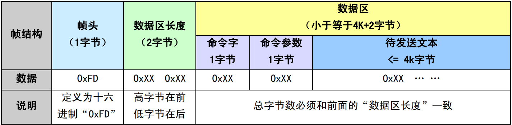
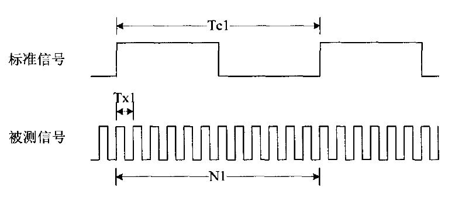

# G32芯片篇

## GD32和STM32的区别

1. 内核

   GD32采用二代的M3内核，STM32主要采用一代M3内核，下图是ARM公司的M3内核勘误表，GD使用的内核只有752419这一个BUG。

   

   主频

   使用HSE(高速外部时钟)：GD32的主频最大108M，STM32的主频最大72M

   使用HSI(高速内部时钟)：GD32的主频最大108M，STM32的主频最大64M

   主频大意味着单片机代码运行的速度更快，项目中如果需要进行刷屏，开放运算，电机控制等操作，GD是一大不错的选择。

3. 供电

   外部供电：GD32外部供电范围是2.63.6V，STM32外部供电范围是23.6V。GD的供电范围比STM32相对要窄一点。

   内核电压：GD32内核电压是1.2V，STM32内核电压是1.8V。GD的内核电压比STM32的内核电压要低，所以GD的芯片在运行的时候运行功耗更低。

4. Flash差异

   GD32的Flash是自主研发的，和STM32的不一样

   GD Flash执行速度：GD32 Flash 中程序执行为0等待周期。

   STM32 FLash执行速度：ST系统频率不访问flash等待时间关系：0等待周期，当0<SYSCLK<24MHz，1等待周期，当24MHz<SYSCLK≤48MHz，2等待周期，当48MHz<SYSCLK≤72MHz。

   Flash擦除时间：GD擦除的时间要久一点，官方给出的数据是这样的：GD32F103/101系列Flash 128KB 及以下的型号， Page Erase 典型值100ms， 实际测量60ms 左右。对应的ST 产品Page Erase 典型值 20~40ms。

5. 功耗

   从下面的表可以看出GD的产品在相同主频情况下，GD的运行功耗比STM32小，但是在相同的设置下GD的停机模式、待机模式、睡眠模式比STM32还是要高的。

6. 串口

   GD在连续发送数据的时候每两个字节之间会有一个Bit的idle，而stm32没有，如下图

   GD的串口在发送的时候停止位只有1/2两种停止位模式。stm32有0.5/1/1.5/2四种停止位模式。

   GD32和stm32 USART的这两种差异对通信基本没有影响，只有GD的通信时间会加长一点。

7. ADC差异

   GD的输入阻抗和采样时间的设置和ST有一定差异，相同配置GD采样的输入阻抗相对来说要小。具体情况见下表这是跑在72M的主频下，ADC的采样时钟为14M的输入阻抗和采样周期的关系：

8. FSMC

   STM32只有100Pin以上的大容量（256K及以上）才有FSMC，GD32所有的100Pin或100Pin以上的都有FSMC。

9. 103系列RAM和FALSH大小差异

   GD103系列和ST103系列的ram和flash对比如下图：

10. 105&107系列STM32和GD的差别

    GD的105/107的选择比ST多的多，

10. 抗干扰能力

    关于这一点，官方没有给出，我也是在做项目的时候偶然发现的，项目原本是用STM32F103C8T6，后来换成GD F103C8T6，这两个芯片的引脚完全一致，然后单片机用了的两个邻近的引脚作为SPI的时钟引脚和数据输出引脚，然后发现STM32的SPI能正常通讯，GD的不行，经过检查发现PCB板SPI的铜线背面有两根IIC的铜线经过，信号应该是受到影响了。

    用示波器看了一下引脚的电平，发现确实是，STM32和GD的数据引脚波形都不正常，但是STM32的波形要好很多，波形虽然差了点，但是SPI通讯依然正常。

    而GD则不能正常通讯了。然后我又把SPI的通讯速率减慢，发现STM32的数据引脚很快就恢复正常波形了，而GD的依然差，直到速率降到很低才恢复正常。初步怀疑是STM32内部对引脚有做一些滤波的电路，而GD则没有。

    虽然我用的这个电路板本身布线有些不合理，但是在同样恶劣的环境下，STM32依然保证了通讯的正常，而GD不行，这在一定程度上说明了GD的抗干扰能力不如STM32。

## GPIO相关设置

### GPIO模式配置

1. 输入输出模式（参考gd2 或 stm32手册）

2. GPIO输出模式下，几种速度的区别

   1. GPIO引脚速度：GPIO_Speed_2MHz（10MHz、50MHz）			

      又称为输出驱动电路的响应速度：芯片内部在I/O口的输出部分安排了多个响应速度不同的输出驱动电路，用户可以根据自己的需要选择合适的驱动电路，通过选择速度来选择不同的输出驱动模块，达到最佳的噪声控制和降低工号的目的。

      可理解为**输出驱动电路的带宽**：即一个驱动电路可以不失真地通过信号的最大频率

      ==如果一个信号的频率超过了驱动电路的响应速度，就有可能信号失真。==信号频率为10MHz，而你配置了2MHz的带宽，则10MHz的方波很可能就变成了正弦波。就好比是公路的设计时速，汽车速度低于设计时速时，可以平稳地运行，如果超过设计时速就会颠簸，甚至翻车。

      如果过GPIO驱动电路的响应速度相对于信号频率太快，会导致功耗加大、噪声加大，会影响正常信号的传输和识别。

      GPIO的引脚速度应该跟应用相匹配，速度配置越高，噪声越大，功耗越大。

      带宽速度搞得驱动器耗电大，噪声也大，带宽低的驱动器耗电小、噪声也小。使用合适的驱动器可以降低功耗和噪声。

      比如：高频的驱动电路，噪声也高，当不需要高的输出频率时，请选用低频驱动电路，这样非常有利于提高系统的EMI性能。当然如果要输出较高频率的信号，但却选用了较低频率的驱动模块，很可能会得到失真的输出信号。关键是GPIO的引脚速度跟应用匹配（推荐10倍以上）。

      一般来说：

      ①　USART串口，若最大波特率只需115.2k，那用2M的速度就够了，既省电也噪声小。

      ②　I2C接口，若使用400k波特率，若想把余量留大些，可以选用10M的GPIO引脚速度。

      ③　SPI接口，若使用18M或9M波特率，需要选用50M的GPIO的引脚速度。

   2. GPIO的反转速度：输入/输出寄存器0，1值反映到外部引脚（APB2上）高低电平的速度，手册上指出GPIO最大反转速度可达18MHz

      通过简单的程序测试，用示波器观察到的翻转时间: 是综合的时间，包括取指令的时间、指令执行的时间、指令执行后信号传递到寄存器的时间(这其中可能经过很多环节，比如AHB、APB、总线仲裁等)，最后才是信号从寄存器传输到引脚所经历的时间。

      有上拉电阻，其阻值越大，RC延时越大，即逻辑电平转换的速度越慢，功耗越大

3. GPIO口设置为输入时，输出驱动电路和端口是断开的，所以输出速度配置无意义。

4. 在复位期间和复位以后，复用功能未开启，I/O端口被配置成浮空输入模式。

5. 所有端口都有外部中断能力。为了使用外部中断线，端口必须配置成输入模式

6. GPIO口的配置具有上锁功能，当配置好GPIO口后，可以通过程序锁住配置组合，直到下次芯片复位才能解锁

7. 一般应用：

   ① 模拟输入_AIN ——应用ADC模拟输入，或者低功耗下省电。

   ② 浮空输入_IN_FLOATING ——可以做KEY识别，RX1

   ③ 开漏输出_Out_OD——应用于I2C总线； （STM32开漏输出若外部不接上拉电阻只能输出0）

### 管脚的复用功能重映射

1. 复用功能：内置外设是与I/O口共用引脚管脚（不同的功能对应同一管脚）

   STM32所有内置外设的外部引脚都是与标准GPIO引脚复用的，如果有多个复用功能对应同一个引脚，只能使能其中之一，其他模块保持非使能状态。

2. 重映射功能：复用功能的引出脚可以通过重映射，从不同的I/O管脚引出，即复用功能的引脚位是可以通过程序改变到其他的引脚上！

   作用：PCB电路板的设计人员可以在需要的情况下，不必把某些喜好在板子上绕一大圈完成连接，方便了PCB的设计同时潜在的减少了信号的交叉干扰。

# Flash-W25Qxx模块篇

## 关于W25Qxx地址的定义

1. W25Q128将16M的[内存](https://so.csdn.net/so/search?q=内存&spm=1001.2101.3001.7020)分为256个块，每个块是64K；又将一个块分为16个扇区，一个扇区是4K；又将一个扇区分为16个页，一个页是256字节地址。话不多说，上图：

2. 在图上右边的红框中可以看到Block0（块0）的地址是000000-00FFFF，再看到左边红框中Block0的16个扇区，地址范围对应的就是Block0的地址范围了，第一个扇区的起始地址就是0000，终止地址是0FFF；第二个扇区的地址就是1000，终止地址是1FFF；剩余的以此类推。假设对第十五个扇区写数据，那么起始地址就是F000。
3. 突然有个简单的想法，你有没有注意到地址是6位（000000h），通过第一点我们是不是可以分解一下，从左到右，第1、2位看成是块，第3位看成是扇区，第4位看成是页，第5、6位看成是页字节。比如我要对第二块的第二个扇区的第二页的第二个字节的位置写一个十六进制数据，那么地址是不是02、2、2、02（块、扇区、页、字节）。

## 点阵字库的烧写

# SYN6658语音合成模块篇

## 编码体系

#### GB2312编码体系

GB2312码是中华人民共和国国家标准汉字信息交换用编码，全称《信息交换用汉字编码字符集 基本集》， 标准号为GB2312－80（GB是“国标”二字的汉语拼音缩写），由中华人民共和国国家标准总局发布，1981 年 5 月1 日实施。习惯上称国标码、GB码，或区位码。它是一个简化字汉字的编码，通行于中国大陆地区。新 加坡等地也使用这一编码。 GB2312-80 收录简化汉字及一般符号、序号、数字、拉丁字母、日文假名、希腊字母、俄文字母、汉语 拼音符号、汉语注音字母，共7445个图形字符。其中汉字以外的图形字符682个，汉字6763个。 GB2312-80 规定，“对任意一个图形字符都采用两个字节（Byte）表示。

| 识别类型      | 识别编码范围      | 备注         |
| ------------- | ----------------- | ------------ |
| 半角ASCII符号 | 0x00 --- 0x7F     |              |
| 全角符号区    | 0xA1A0 --- 0xA3FE |              |
| 汉字区        | 0xB0A1 -- 0xF7FE  | 共6768个汉字 |

#### GBK编码体系

GB2312-80仅收汉字6763个，这大大少于现有汉字，随着时间推移及汉字文化的不断延伸推广，有些原来 很少用的字，现在变成了常用字，这使得表示、存储、输入、处理都非常不方便。 为了解决这些问题，以及配合UNICODE的实施，全国信息技术化技术委员会于1995年12月1日《汉字内码 扩展规范》。GBK向下与GB2312完全兼容，向上支持ISO-10646国际标准。 GBK是GB2312-80的扩展，是向上兼容的。它包含了20902 个汉字，其编码范围是0x8140-0xfefe。其所有 字符都可以一对一映射到UNICODE 2.0。GBK亦采用双字节表示。 

| 识别类型      | 识别编码范围                         | 备注          |
| ------------- | ------------------------------------ | ------------- |
| 半角ASCII符号 | 0x00 --- 0x7F                        |               |
| 全角符号区    | 0xA1A0 --- 0xA3FE                    |               |
| 汉字区        | 0x8140 --- 0xA0FE；0xAA40 --- 0xFEFE | 共21003个汉字 |

#### BIG5编码体系

BIG5是台湾计算机界实行的汉字编码字符集。它包含了 420 个图形符号和 13070 个繁体汉字（不包含 简化汉字）。编码范围是 0x8140-0xFE7E、0x81A1-0xFEFE，其中 0xA140-0xA17E、0xA1A1-0xA1FE 是图 形符号区，0xA440-0xF97E、0xA4A1-0xF9FE 是汉字区。

| 识别类型      | 识别编码范围      | 备注          |
| ------------- | ----------------- | ------------- |
| 半角ASCII符号 | 0x00 --- 0x7F     |               |
| 全角符号区    | 0xA140 --- 0xA3FE |               |
| 汉字区        | 0xA440 --- 0xF9FE | 共13060个汉字 |

#### Unicode 编码体系

在创造UNICODE之前，有数百种编码系统。但是，没有任何一个编码可以包含足够的字符。面临的现实问 题是：使用相同的数字代表两个不同的字符，或使用不同的数字代表相同的字符。任何一台特定的计算机(特 别是服务器)都需要支持许多不同的编码，但是，不论什么时候数据通过不同的编码或平台之间，那些数据总 会有损坏的危险。 而在UNICODE标准中，提供了1,114,112 个码点，不仅可以包含当今世界使用的所有语言文字和其他符号， 也足够容纳绝大多数具有历史意义的古文字和符号。并且UNICODE给每个字符提供了一个唯一的数字，不论是 什么平台，不论是什么程序，不论什么语言。UNICODE标准已经被工业界所采用，许多操作系统，所有最新的 浏览器和许多其他产品都支持它。UNICODE标准的出现和支持它的工具的存在，是近来全球软件技术最重要的 发展趋势。 

| 识别类型   | 识别编码范围                  | 备注          |
| ---------- | ----------------------------- | ------------- |
| 全角符号区 | 0x00 区， 0x30 区， 0xFF 区， |               |
| 汉字区     | 0x4E00 ---- 0x9FFF            | 共20902个汉字 |

## SYN6658芯片使用

### 系统构成框图

最小系统包括：控制器模块、SYN6658语音合成芯片、功放模块和喇叭。 主控制器和SYN6658语音合成芯片之间通过UART 接口或SPI接口连接，控制器可通过通讯接口向 SYN6658语音合成芯片发送控制命令和文本，SYN6658语音合成芯片把接收到的文本合成为语音信号输出， 输出的信号经功率放大器进行放大后连接到喇叭进行播放。 

### 芯片控制方式

上位机以命令帧的格式向 SYN6658 芯片发送命令。SYN6658 芯片根据命令帧进行相应操作，并向上位机返回命令操作结果，也叫做芯片回传，芯片会向上位机发送一个字节的转态回传，上位机可以根据这个回传来判断芯片目前的工作状态。

#### 控制命令列表

| 命令功能                | 说明                                                   |
| ----------------------- | ------------------------------------------------------ |
| 语音合成播放命令        | 合成并播放本次发送的文本                               |
| 停止合成命令            | 停止当前的合成动作                                     |
| 暂停合成命令            | 暂停正在进行的合成                                     |
| 恢复合成命令            | 继续合成被暂停的文本                                   |
| 芯片状态查询命令        | 查询当前芯片的工作状态                                 |
| 进入 Standby 模式的命令 | 使芯片从正常工作模式进入 Standby模式，接任何命令后恢复 |
| 唤醒命令                | 使芯片从 Standby 模式进入正常工作模式                  |

#### 回传状态列表

接收到控制命令帧，芯片会向上位机发送1 个字节的状态回传，上位机可根据这个回传来判断芯片目前 的工作状态。 

- SYN6658 芯片在初始化成功时会发送一个字节的“初始化成功”回传。 
- SYN6658 芯片收到命令帧后会判断此命令帧正确与否。如果命令帧正确，则返回“接收成功”回传；如 果命令帧错误，则返回“接收失败” 回传。 
- SYN6658 芯片收到状态查询命令时，如果芯片正处于播音的工作状态则返回“正在播音”回传，如果芯 片处于空闲状态则返回“芯片空闲”回传。==在一帧数据合成完毕后，芯片会自动返回一次“芯片空闲”的回 传==。 

| 回传类型名称           | 回传数据 | 触发条件                                                     |
| ---------------------- | -------- | ------------------------------------------------------------ |
| 初始化成功回传         | 0x4A     | 芯片初始化成功                                               |
| 收到正确的命令帧回传   | 0x41     | 接收成功，收到正确的命令帧                                   |
| 收到不能识别命令帧回传 | 0x45     | 接收失败，收到错误的命令帧                                   |
| 芯片播音状态回传       | 0x4E     | 收到“状态查询命令帧”，芯片处在正在播音状态                   |
| 芯片空闲状态回传       | 0x4F     | 当一帧数据合成完以后，芯片进入空闲状态回传0x4F；或 者收到“状态查询命令帧”，芯片处于空闲状态回传0x4 |

### 通讯方式

SYN6658 芯片支持 UART 接口和 SPI 接口两种通讯方式

异步串行通讯模式（UART）中支持4中波特率：4800 bps、9600 bps、57600 bps、115200 bps，可以通过芯片上的两个管脚 BAUD0、BAUD1 上的电平来进行硬件配置。

| 波特率/bps | BAUD0 | BAUD1 |
| ---------- | ----- | ----- |
| 4800       | 0     | 0     |
| 9600       | 0     | 1     |
| 57600      | 1     | 0     |
| 115200     | 1     | 0     |

### 通信帧定义及通信控制

#### 命令帧格式

芯片支持以下命令帧格式：“帧头FD + 数据区长度+数据区”格式。 上位机发送给SYN6658芯片的所有命令和数据都需要用“帧”的方式进行封装后传输。

**注意：数据区（含命令字，命令参数，待发送文本）的实际字节数必须与帧头后定义的数据区长度严格一致， 否则芯片会报接收失败。**

#### 芯片支持的控制命令

#### 命令帧相关的特别说明

- 当 SYN6658 芯片正在合成文本的时候，如果又接收到一帧有效的合成命令帧，芯片会立即停止当前 正在合成的文本，转而合成新收到的文本。 
- 待发送文本长度必须小于等于4096字节。实际发送的长度大于4096时，芯片会报接收失败。

### 文本控制标记 

因为汉字博大精深的文化底蕴，和当前技术发展的限制，语音合成还不能做到百分之百的准确。为满足 客户在各种复杂环境的个性化需求，特推出以下文本控制标记，用于灵活控制汉字发音的变化。

| 作用               | 控制 标识 | 默认 设置 | 详细说明                                                     |
| ------------------ | --------- | --------- | :----------------------------------------------------------- |
| 选择发音人         | [m*]      | [m3]      | (*= 3, 51, 52, 53, 54, 55)    3 - 晓玲 (女声)     51 - 尹小坚 (男声)     52 - 易小强 (男声)     53 - 田蓓蓓 (女声)     54 - 唐老鸭 (效果器)     55 - 小燕子 (女童声) |
| 设置音量           | [v*]      | [v5]      | (*=0~10) * - 音量值（0至10） 说明： 音量的调节范围为静音到音频设备支持的最大值 |
| 设置语速           | [s*]      | [s5]      | (*=0~10) \* - 语速值（0至10） 说明：语速值越小，语速越慢     |
| 设置语调           | [t*]      | [t5]      | (*=0~10) * - 语调值（0至10） 说明： 语调值越小，基频值越低   |
| 恢复默认的合成参数 | [d]       |           | 所有设置（除发音人设置外）恢复为默认值                       |

- 控控制标识为全局控制标识的，也就是只要用了一次，在不对芯片进行复位、或断电、或使用[d]恢复默认 设置的条件下，其后发送给芯片的所有文本都会处于它的控制之下。注意：选择发音人[m*]不受[d]控制，要恢复默认发音人，必须用[m3]恢复。
- 当芯片掉电或是复位后，原来的设置过的标识会失去作用，芯片将恢复到所有的默认值。 

# 串口通信协议篇

监控计算机和可变信息标志之间通过帧数据的形式传递信息，监控计算机和可变信息标志的每次通信过程包括完整的一个来回：

- 监控计算机向可变信息标志发送命令帧
- 可变信息标志向监控计算机发送应答帧

### 命令帧结构

| 字段 | 字节数 | 描述                                                 | 数值    |
| ---- | ------ | ---------------------------------------------------- | ------- |
| 1    | 1      | 帧开始-----接收同步字节                              | 0x02    |
| 2    | 2      | 可变信息标志的设备地址，ASCII 码                     | 0-99    |
| 3    | 2      | 帧类型，ASCII 码                                     | 0-99    |
| 4    | 2      | 数据长度，十六进制数（高字节先发）                   |         |
| 5    | N      | 帧数据，长度不定，十六进制数                         |         |
| 6    | 2      | 帧校验（仅RS232）-----判断接收帧的正确性，十六进制数 | 16位CRC |
| 7    | 1      | 帧结束-----接收同步字节                              | 0x03    |

### 应答帧结构

| 字段 | 字节数 | 描述                                                 | 数值    |
| ---- | ------ | ---------------------------------------------------- | ------- |
| 1    | 1      | 帧开始-----接收同步字节                              | 0x02    |
| 2    | 2      | 可变信息标志的设备地址，ASCII  码                    | 0-99    |
| 3    | 2      | 帧类型，ASCII 码                                     | 0-99    |
| 4    | 2      | 数据长度，十六进制数（高字节先发）                   |         |
| 5    | N      | 帧数据，十六进制数                                   |         |
| 6    | 2      | 帧校验（仅RS232）-----判断接收帧的正确性，十六进制数 | 16位CRC |
| 7    | 1      | 帧结束-----接收同步字节                              | 0x03    |

### 代码结构

帧数据的通信过程可以分为三个部分，包括消息成帧，消息处理，消息应答三个部分

#### 消息成帧

串口一旦接收到帧消息的字节数据就会将其放到一个桶形的缓冲区中，消息成帧过程中会从该桶形缓冲区中依次取出每个字节进行成帧处理，完整的帧命令数据存放在帧接收缓冲区中；成帧处理由状态机完成，状态机包括7个状态（由通信协议决定）：帧开始转态、帧地址状态、帧类型状态、帧数据长度状态、帧数据状态、帧校验状态、帧结束状态。一帧数据分了7个状态来接收，每接收到一个字节时，会根据当前接收的状态对该字节进行相应处理。

#### 消息处理

一帧数据接收完毕后，进入到帧消息处理的阶段，即根据帧消息的帧类型来判定应该调用那个处理函数，比如获取系统状态函数、设置灯亮度和模式函数、获取灯亮度函数等。在这些处理函数中形成帧应答命令，帧应答命令存放在帧发送缓冲区。

#### 消息应答

在串口成功发送完上一段应答帧命令的条件下，将帧应答缓冲区中的帧应答数据转存到串口发送缓冲区，开启串口发送中断，将数据从串口发送出去。

# 环境亮度检测模块篇

## ALS-PDT243亮度传感器

## AD654芯片

AD654是压频转换芯片

网页资料：[一种上位机实时反馈输出电压/电流电路，压频转换芯片——AD654 (360doc.com)](http://www.360doc.com/content/19/0413/23/441458_828600439.shtml)

## MCU检测信号频率

参考文档：[用STM32定时器测量信号频率——测频法和测周法[原创cnblogs.com/helesheng\] - helesheng - 博客园](https://www.cnblogs.com/helesheng/p/14107012.html)

​					[(42条消息) STM32 检测信号频率_BobBobBao的博客-CSDN博客_stm32 测量频率](https://blog.csdn.net/sinat_22081411/article/details/117256776)

### 检测原理--测频法和测周法

#### 测频法（计频法）原理

适用于：使用低频的标准信号测量高频的被测信号

计数器测得标准信号一个周期Tc1内，被测信号共出现了N1个脉冲，则被测信号的频率为：

误差来源：计数器只能进行整数计数，而在标准信号的Tc1时间周期内，却不一定刚好有整数个被测信号周期。因此测频法造成的最大测量误差为±1个被测信号，参考上面的工式，若计数结果为N1，则频率的最大可能值为fx1=(N1+1)fc1；最小可能值为fx1=(N1-1)fc1。相对频率误差为：ef=±1/N1×100% ，因此N1越大，相对频率误差越小。

#### 测周法（计时法）原理

适用于：标准信号的频率大于被测信号的频率

被测信号的一个周期Tx2内测得标准信号出现N2个脉冲，则被测信号的周期为：

误差来源：计数器只能进行整数计数，而在Tx2时间窗口内，却不一定刚好有整数个标准信号周期。因此测周法造成的最大测量误差为±1个标准信号周期，参考上面的工式，若计数结果为N2，则测量周期的最大可能值为Tx2+=(N2+1)Tc2；最小可能值为Tx2+=(N2+1)Tc2。相对周期误差为：eT=±1/N2×100% ，因此N2越大，相对周期误差越小。

### mcu实现方法

1. 外部中断：每次一个上升沿/下降沿进入一次中的记录脉冲次数。低频（<10KHz）时可以使用，缺点是频繁进入中断，占用大量时间，不能用于测量高频
2. PWM输入模式：直接使用STM32硬件PWM输入模式来采集频率
3. 输入输入捕获模式：被测信号的上升沿触发，标准信号记录开始时间（计数值），下一次被测信号的上升沿时，再次记录标准信号的结束时间（计数值），两个时间之差就是被测信号的周期。<100KHz时效果很好，速度再快反复进出中断会导致检测精度下降。
4. 外部时钟计数器：使用两个时钟，一个时钟用于精准计时，一个时钟用于被测信号固定时间内的脉冲计数。比如一个时钟精准定时10ms，另一个时钟用于记录10ms内被测信号的脉冲的个数cnt，那么被测信号的频率为：f=cnt/10ms。此方法要使用两个单独的定时器，可以检测2MHz的信号。

### 定时器输入捕获模式实现测周法测频

# 其他硬件

## 74hc245芯片

74hc245是一种兼容TTL器件引脚的高速CMOS总线收发器（bus transceiver），典型的CMOS型三态缓冲门电路，八路信号收发器。由于单片机或CPU的数据/地址/控制总线端口都有一定的负载能力，如果负载超过其负载能力，一般应加驱动器。主要应用于大屏显示,以及其它的消费类电子产品中增加驱动。

74hc245是方向可控的八路缓冲器，主要用于实现数据总线的双向异步通信。为了保护脆弱的主控芯片，通常在主控芯片的并行接口与外部受控设备的并行接口间添加缓冲器。当主控芯片与受控设备之间需要实现双向异步通信时，自然就得选用双向的八路缓冲器了，74hc245就是面向这种需求的。常见于同并口液晶屏、并口打印机、并口传感器或通讯模块等设备的接口上。

# 自检命令

## flash的自检命令

### 80-FLASH扇区读

 * 功能：FLASH 扇区读
 * 帧头 + 设备地址 + 命令类型 + 数据长度 +  起始地址 + 读取字节数 + 校验位 + 帧尾
 * 1              2                   2                 2                    3                  2                 2             1 
 * 帧头 + 设备地址 + 命令类型 + 数据长度 +  flag + 读取的数据 + 校验位 + 帧尾
 * 1                2                 2                  2              1                n               2             1 
 * 02 30 30 38 30 00 05 00 00 00 04 00 13 14 03 从起始地址0x000000读取1024个字节
 * 02 30 30 38 30 00 05 00 10 00 04 00 13 14 03 从起始地址0x001000读取1024个字节

### 81-向FLASH写数据

 * 功能：向FLASH中写入数据
 * 帧头 + 设备地址 + 命令类型 + 数据长度 + 起始地址 + 字节数 + 数据  + 校验位 + 帧尾
 * 1                2                  2                 2                3                2            n            2             1 
 * 帧头+设备地址+命令类型+数据长度+ flag +校验位+帧尾
 * 1              2               2               2              1        2         1 
 * 02 30 30 38 31 00 07 00 00 00 00 02 36 34 13 14 03 从起始地址0x000000 写入两个字节，为36 34
 * 02 30 30 38 31 00 0f 00 00 00 00 0a 01 02 03 04 05 06 07 08 09 10 13 14 03 从起始地址0x000000 写入十个字节

### 82-擦除指定的FLASH扇区

 * 82-功能：擦除指定的FLASH扇区
 * 帧头 + 设备地址 + 命令类型 + 数据长度 + 起始地址 + 校验位 + 帧尾
 * 1                 2                2                  3                 3                2            1
 * 帧头+设备地址+命令类型+数据长度+flag+校验位+帧尾
 *  1              2                2                2           3        2         1 
 * 02 30 30 38 32 00 03 00 00 00 13 14 03 擦除0x000000处的扇区

### 83-向FLASH写256个字节（01 - FF）

 * 83-功能：向flash中某地址写256个字节-01 02 . . . FF
 * 帧头 + 设备地址 + 命令类型 + 数据长度 + 起始地址 + 校验位 + 帧尾
 * 1               2                  2                 3                 3                  2          1
 * 帧头 + 设备地址 + 命令类型 + 数据长度 + flag + 校验位 + 帧尾
 *  1              2                   2                 2              3           2           1 
 * 02 30 30 38 33 00 03 00 00 00 13 14 03 向起始地址0x000000写256个字节

# 其他问题

## 关于情报板演示软件

1. 遇到串口控件操作不受支持的问题

   需要安装串口控件MSCOMM32.OCX，官网https://www.ocxme.com/files/mscomm32_ocx 下载MSCOMM32.OCX，解压复制放在C:\Windows\SysWOW64\ 目录下，在C:\Windows\System32目录下以管理员的方式打开cmd.exe，然后输入`regsvr32 C:\Windows\SysWOW64\MSCOMM32.OCX`  ，确定注册成功。

02 30 30 38 30 00 05 00 00 00 00 04 00 00 03

02 30 30 38 30 00 05 00 00 00 00 00 00 00 03

## 5.15版qt安装

1. qt 5.15版本及以上不支持离线安装。下载[在线安装包](https://download.qt.io/official_releases/online_installers/)。
2. 但是由于中国网络的问题，在线安装的时候总是无法连接到 download.qt.io网址，需要将网址`download.qt.io`重定向到一个镜像源。下载 [fidder everywhere](https://link.zhihu.com/?target=https%3A//www.telerik.com/fiddler)，在fiddler everywhere中替换`download.qt.io`为`mirrors.tuna.tsinghua.edu.cn/qt/`，
